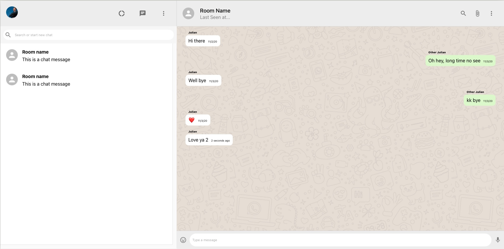

# WhatsApp clone built with the MERN stack
has basic posting capability implemented with Pusher to make it realtime. Gonna build out user login/auth later on.

View the site here: https://whatsapp-clone-frontend.firebaseapp.com

